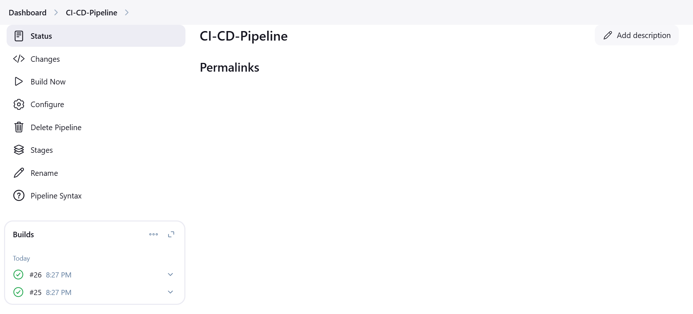
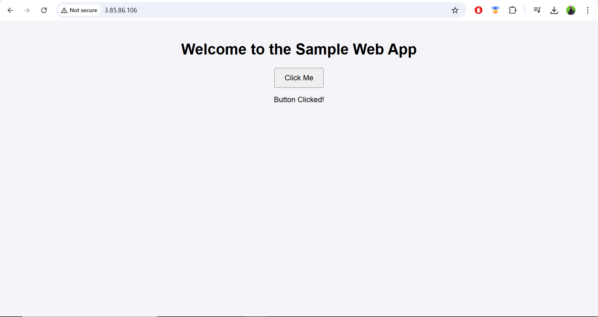

# Sample Web Application

This is a simple web application built with HTML, CSS, and JavaScript, complemented by Docker for containerization. Below is a structured guide to help you understand and implement the project seamlessly.

---

## Task 1: Version Control Integration

### Step-by-Step Guide

#### 1. Create the Files

##### **index.html**
Define the structure of the web page and include links to style.css and script.js:

```html
<!DOCTYPE html>
<html lang="en">
<head>
    <meta charset="UTF-8">
    <meta name="viewport" content="width=device-width, initial-scale=1.0">
    <title>Sample Web App</title>
    <link rel="stylesheet" href="style.css">
</head>
<body>
    <h1>Welcome to the Sample Web App</h1>
    <button id="changeMessage">Click Me!</button>
    <p id="message">Hello, World!</p>
    <script src="script.js"></script>
</body>
</html>
```

##### **style.css**
Create basic styling for your web page:

```css
body {
    font-family: Arial, sans-serif;
    text-align: center;
    margin: 0;
    padding: 0;
    background-color: #f4f4f9;
}

h1 {
    color: #333;
}

button {
    padding: 10px 20px;
    font-size: 16px;
    cursor: pointer;
}

p {
    color: #555;
}
```

##### **script.js**
Add JavaScript for user interaction:

```javascript
document.getElementById('changeMessage').addEventListener('click', () => {
    document.getElementById('message').textContent = 'You clicked the button!';
});
```

---

## Task 2: Containerization with Docker

### Step-by-Step Guide

#### 1. Add SSH Key Files
Place the SAMPLE-WEB-APP (private key) and SAMPLE-WEB-APP.pub (public key) securely in the project directory. Ensure these files are protected and not exposed publicly.

#### 2. Create a Dockerfile
Define a Dockerfile to containerize your application:

```Dockerfile
FROM nginx:alpine
COPY . /usr/share/nginx/html
```

#### 3. Build and Run the Docker Container
Steps:

- Navigate to the project directory:

```bash
cd /path/to/sample-web-app
```

- Build the Docker image:

```bash
docker build -t sample-web-app .
```

- Run the container:

```bash
docker run -d -p 80:80 sample-web-app
```
#### 4 Bonus: Use Docker Compose for Multi-Container Setup
- Create a docker-compose.yml File
```
version: '3.8'
services:
  web:
    build: .
    ports:
      - "80:80"
```

- Start the Multi-Container Setup
 Run:
```bash
docker-compose up -d
```
This builds and runs your application in a Docker Compose environment.

---
Security Note

Ensure sensitive files, such as SAMPLE-WEB-APP and SAMPLE-WEB-APP.pub, are not exposed to public repositories or unauthorized users. Use .gitignore to exclude them from version control.

```
SAMPLE-WEB-APP
SAMPLE-WEB-APP.pub

```
## Task 3: Infrastructure as Code (IaC)
### Step-by-Step Guide
- Prerequisites

Install Terraform:
Download from the Terraform website.

Install AWS CLI (for AWS deployments):

Download and configure using:

```bash
aws configure
```
Provide your Access Key, Secret Key, Region, and Output format.

Create an SSH key pair in your AWS account for accessing the EC2 instance.

#### 1. Create the Project Structure

```plaintext
terraform-iac/
├── main.tf        # Main Terraform configuration
├── variables.tf   # Input variables
├── outputs.tf     # Outputs
├── terraform.tfvars # (Optional) Variable values
```

#### 2. Define Resources in main.tf
Example for VPC and EC2 instance setup:

2. **Define the VPC**:
- Example `main.tf`:
  ```hcl
  module "vpc" {
    source = "terraform-aws-modules/vpc/aws"

    name = "my-vpc"
    cidr = "10.0.0.0/16"
    azs = ["us-east-1a", "us-east-1b"]
    public_subnets = ["10.0.1.0/24", "10.0.2.0/24"]

    tags = {
      Terraform = "true"
      Environment = "dev"
    }
  }
  ```

3. **Define the EC2 Instance**:
- Example `main.tf` (continued):
  ```hcl
  module "ec2_instance" {
    source = "terraform-aws-modules/ec2-instance/aws"

    name = "sample-instance"
    ami = "ami-0c02fb55956c7d316" # Amazon Linux 2
    instance_type = "t2.micro"
    key_name = "your-key-pair"
    subnet_id = module.vpc.public_subnets[0]
  }
  ```


4. **Outputs**:
- Example `outputs.tf`:
  ```hcl
  output "instance_public_ip" {
    value = module.ec2_instance.public_ip
  }
  ```

5. **Deploy the Infrastructure**:
- Initialize Terraform:
  ```bash
  terraform init
  ```
- Plan the deployment:
  ```bash
  terraform plan
  ```
- Apply the deployment:
  ```bash
  terraform apply
  ```  

6. **Verify Resources**


Log in to the AWS Management Console.

Verify:

 - A VPC is created with public and private subnets.

 - An EC2 instance is running in one of the public subnets.

 - The instance has a public IP address.

Use the following command to view outputs
```bash
terraform output
```

---

## Task 4: CI/CD Pipeline with Cloud Integration 

### **Steps**

1. **Set Up Jenkins**:
- Install Jenkins and necessary plugins (e.g., Docker, Git).

2. **Pipeline Definition**:
- Create a `Jenkinsfile`:
  ```groovy
  pipeline {
      agent any
      stages {
          stage('Clone Repository') {
              steps {
                  git 'https://github.com/your-repo.git'
              }
          }
          stage('Build Docker Image') {
              steps {
                  sh 'docker build -t sample-web-app .'
              }
          }
          stage('Push to DockerHub') {
              steps {
                  withCredentials([string(credentialsId: 'dockerhub-credentials', variable: 'DOCKERHUB_TOKEN')]) {
                      sh '''
                      docker login -u your-dockerhub-username -p $DOCKERHUB_TOKEN
                      docker push your-dockerhub-username/sample-web-app
                      '''
                  }
              }
          }
          stage('Deploy to EC2') {
              steps {
                  sshagent(['ssh-key-id']) {
                      sh '''
                      ssh -o StrictHostKeyChecking=no ec2-user@<EC2-IP> \
                      "docker run -d -p 80:80 your-dockerhub-username/sample-web-app"
                      '''
                  }
              }
          }
      }
  }
  ```

3. **Test the Pipeline**:
- Run the pipeline in Jenkins and verify each stage.





---

## Additional Notes
- **Security**: Use `.gitignore` to exclude sensitive files such as SSH keys.


# Set Up Monitoring Using Prometheus and Grafana on an Existing Amazon Linux 2 Instance

## **1. Prepare the Existing Instance**
1. Log in to your existing Amazon Linux 2 EC2 instance using SSH:
   ```bash
   ssh -i your-key.pem ec2-user@<your-ec2-public-ip>
   ```

2. Update the system:
   ```bash
   sudo yum update -y
   ```

3. Ensure necessary ports are open in the security group:
   - **Port 9090**: Prometheus web interface.
   - **Port 3000**: Grafana web interface.
   - **Port 9100**: Node Exporter metrics.
   - **Port 22**: SSH access.

---

## **2. Install Prometheus**

### **Step 1: Download and Install Prometheus**
1. Download Prometheus:
   ```bash
   wget https://github.com/prometheus/prometheus/releases/download/v3.1.0/prometheus-3.1.0.linux-amd64.tar.gz
   ```
2. Extract the archive:
   ```bash
   tar -xvzf prometheus-3.1.0.linux-amd64.tar.gz
   cd prometheus-3.1.0.linux-amd64
   ```
3. Move Prometheus binaries:
   ```bash
   sudo mv prometheus /usr/local/bin/
   sudo mv promtool /usr/local/bin/
   ```
4. Create directories for Prometheus:
   ```bash
   sudo mkdir -p /etc/prometheus /var/lib/prometheus
   sudo mv prometheus.yml /etc/prometheus/
   ```
5. Set correct permissions:
   ```bash
   sudo chown ec2-user:ec2-user /etc/prometheus /var/lib/prometheus
   ```

### **Step 2: Create a Prometheus Systemd Service**
1. Create a service file:
   ```bash
   sudo nano /etc/systemd/system/prometheus.service
   ```
2. Add the following content:
   ```ini
   [Unit]
   Description=Prometheus Monitoring
   After=network.target

   [Service]
   User=ec2-user
   ExecStart=/usr/local/bin/prometheus --config.file=/etc/prometheus/prometheus.yml --storage.tsdb.path=/var/lib/prometheus
   Restart=always

   [Install]
   WantedBy=multi-user.target
   ```
3. Reload systemd and start Prometheus:
   ```bash
   sudo systemctl daemon-reload
   sudo systemctl start prometheus
   sudo systemctl enable prometheus
   ```

### **Step 3: Verify Prometheus**
1. Access Prometheus in your browser:
   ```
   http://<your-ec2-public-ip>:9090
   ```

---

## **3. Install Node Exporter**

### **Step 1: Download and Install Node Exporter**
1. Download Node Exporter:
   ```bash
   wget https://github.com/prometheus/node_exporter/releases/download/v1.6.1/node_exporter-1.6.1.linux-amd64.tar.gz
   ```
2. Extract the archive:
   ```bash
   tar -xvzf node_exporter-1.6.1.linux-amd64.tar.gz
   sudo mv node_exporter-1.6.1.linux-amd64/node_exporter /usr/local/bin/
   ```

### **Step 2: Create a Node Exporter Systemd Service**
1. Create a service file:
   ```bash
   sudo nano /etc/systemd/system/node_exporter.service
   ```
2. Add the following content:
   ```ini
   [Unit]
   Description=Node Exporter
   After=network.target

   [Service]
   User=ec2-user
   ExecStart=/usr/local/bin/node_exporter
   Restart=always

   [Install]
   WantedBy=multi-user.target
   ```
3. Reload systemd and start Node Exporter:
   ```bash
   sudo systemctl daemon-reload
   sudo systemctl start node_exporter
   sudo systemctl enable node_exporter
   ```

### **Step 3: Verify Node Exporter**
1. Access Node Exporter metrics in your browser:
   ```
   http://<your-ec2-public-ip>:9100/metrics
   ```

### **Step 4: Update Prometheus to Scrape Node Exporter Metrics**
1. Open the Prometheus configuration file:
   ```bash
   sudo nano /etc/prometheus/prometheus.yml
   ```
2. Add the following to `scrape_configs`:
   ```yaml
   scrape_configs:
     - job_name: 'node_exporter'
       static_configs:
         - targets: ['localhost:9100']
   ```
3. Save and validate the configuration:
   ```bash
   promtool check config /etc/prometheus/prometheus.yml
   ```
4. Restart Prometheus:
   ```bash
   sudo systemctl restart prometheus
   ```

---

## **4. Install Grafana**

### **Step 1: Add the Grafana Repository**
1. Create the Grafana repository file:
   ```bash
   sudo tee /etc/yum.repos.d/grafana.repo <<EOF
   [grafana]
   name=grafana
   baseurl=https://packages.grafana.com/oss/rpm
   repo_gpgcheck=1
   enabled=1
   gpgcheck=1
   gpgkey=https://packages.grafana.com/gpg.key
   EOF
   ```

### **Step 2: Install and Start Grafana**
1. Install Grafana:
   ```bash
   sudo yum install grafana -y
   ```
2. Start and enable Grafana:
   ```bash
   sudo systemctl start grafana-server
   sudo systemctl enable grafana-server
   ```

### **Step 3: Access Grafana**
1. Access Grafana in your browser:
   ```
   http://<your-ec2-public-ip>:3000
   ```
2. Log in with default credentials:
   - **Username**: admin
   - **Password**: admin


### **Step 4: Configure Prometheus as a Data Source**
1. In Grafana, go to **Configuration > Data Sources**.
2. Add a new data source:
   - **Type**: Prometheus
   - **URL**: `http://localhost:9090`
3. Save and test the data source.

---

### **5. Set Up Alerts in Prometheus**

#### **Step 1: Configure Alerting in Prometheus**
1. Open the Prometheus configuration file:
   ```bash
   sudo nano /etc/prometheus/prometheus.yml
   ```
2. Add the following:
   ```yaml
   alerting:
     alertmanagers:
       - static_configs:
           - targets:
               - 'localhost:9093'

   rule_files:
     - "/etc/prometheus/alerts.yml"
   ```
3. Save and validate the configuration:
   ```bash
   promtool check config /etc/prometheus/prometheus.yml
   ```

#### **Step 2: Create Alert Rules**
1. Create the alert rules file:
   ```bash
   sudo nano /etc/prometheus/alerts.yml
   ```
2. Add an example alert rule:
   ```yaml
   groups:
     - name: instance_health
       rules:
         - alert: InstanceDown
           expr: up == 0
           for: 1m
           labels:
             severity: critical
           annotations:
             summary: "Instance {{ $labels.instance }} is down"
             description: "The instance {{ $labels.instance }} has been unreachable for more than 1 minute."
   ```
3. Save and restart Prometheus:
   ```bash
   sudo systemctl restart prometheus
   ```

---

### **6. Verify Monitoring Setup**
1. Check the Prometheus Targets:
   - Go to **Status > Targets** in Prometheus UI.
   - Ensure both `prometheus` and `node_exporter` targets are listed and marked as `UP`.

2. Check Metrics in Grafana:
   - Create a new dashboard in Grafana.
   - Add a panel and use Prometheus queries (e.g., `node_cpu_seconds_total`) to visualize metrics.

---
